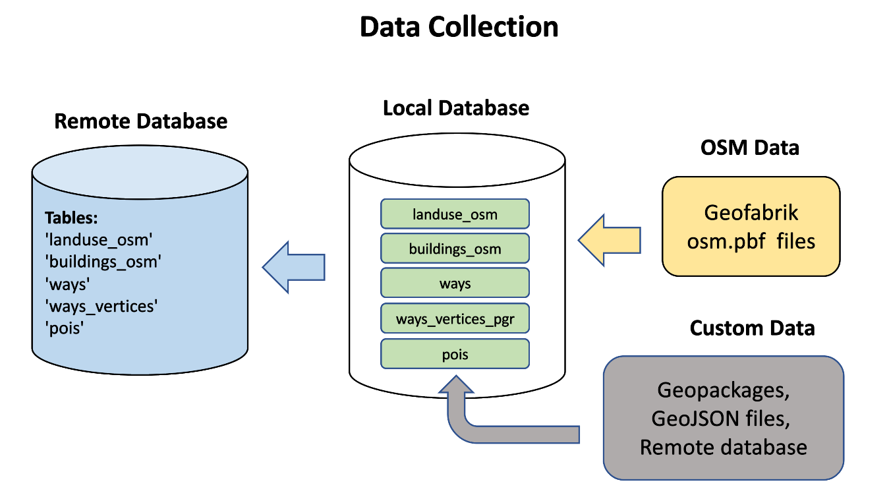
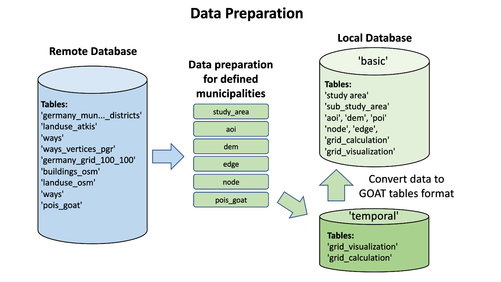
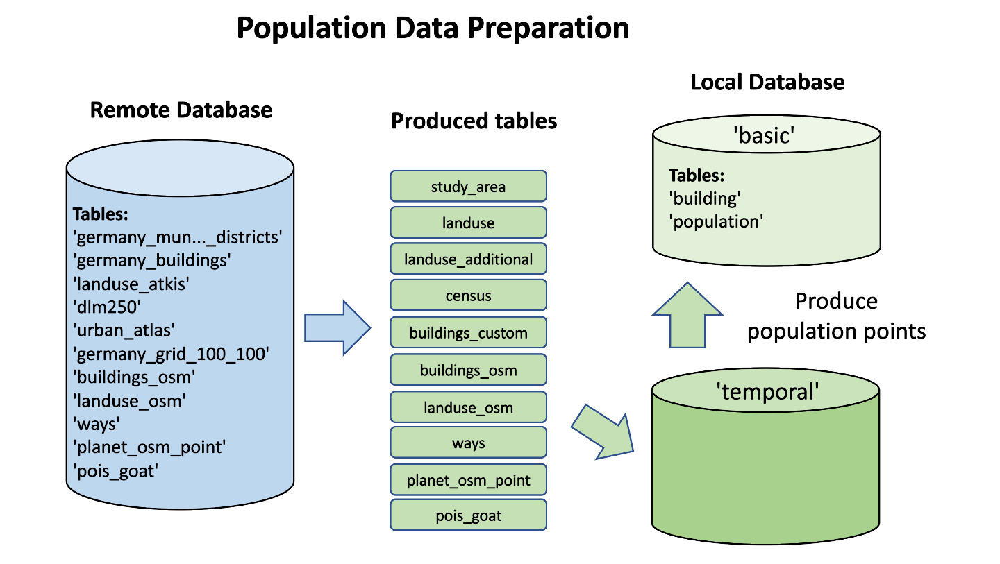

# Welcome to Documentation for Data Preparation for GOAT.

This repository provides tools that allow to collect and process spatial data for subsequent use in the GOAT application.

Data preparation can be logically subdivided in two steps:

### **1. Data Collection.** 
This step is used for preliminary collection of data.
Perform data collection using the command line, by calling __collect.py__. Data can be collected and prepared in large volumes (minimum Regirungbezirke). OSM data are used as the main source. The data collected by OSM are processed and enriched with additional data sources. 

- **Network**. Original network data is processed with **__osm2grouting__** during the collection then fitered and processed susequently with SQL scripts for preparation. As a result in local database are stored two tables **__ways__** and **__ways_vertices_pgr__**. Can be called in command line by `collect.py -c network`. See chapter __Data Collection/Network__.

- **Buildings**. The process allows to collect and prepare buildings from OSM data. Returns table in local database **__buildings_osm__**. Can be called in command line by `collect.py -c buildings`. See chapter __Data Collection/Buildings__.

- **Landuse**. Landuse polygons from OSM data. Process returns table in local database **__landuse_osm__**. Can be called in command line by `collect.py -c landuse`. See chapter __Data Collection/Landuse__.

- **POIs**. As other process for data collection, it collects, filters and prepares data from OSM in a format fittable for GOAT. Process returns table **__pois__** stored in local database. Can be called in command line by `collect.py -c pois`. See chapter __Data Collection/POIs__.

For **POIs** it is neccessary to execute **fusion** process. Not only it is used for fusion or replacement parts of OSM data with custom data but also within the process **__poi_goat_id__** should be created. Can be called in command line by `collect.py -f pois`. Process returns table **__pois_goat__** stored in local database. For additional information see chapter __Data Collection/POIs__. 

#### !!! The result tables should be restored in remote database.

### **2. Data Preparation**
Next step is used for prepartion data sets in form of tables in the local database. 

Almost all data tables (except __population__ and __buildings__) could be generated with the help of command line `python prepare.py -p LAYERNAME -m MUNICIPALITIES_CODES`. It requires connection to remote database and tables collected in step of data collection and prepared before(__germany_municipalities_districts__) List of reqired tables are showed on pic. Result will be stored in local database in schema __basic__.

**Population/Buildings** Population and buildings generates in one step with command line: `python prepare.py -p LAYERNAME -m MUNICIPALITIES_CODES`. It requires various of data be stored in remote database. 

The result will be presented in two tables __population__ and __building__ stored in schema __basic__ in local database.

Subsequetly created in schema __basic__ tables could be dumped and restored in GOAT app database.